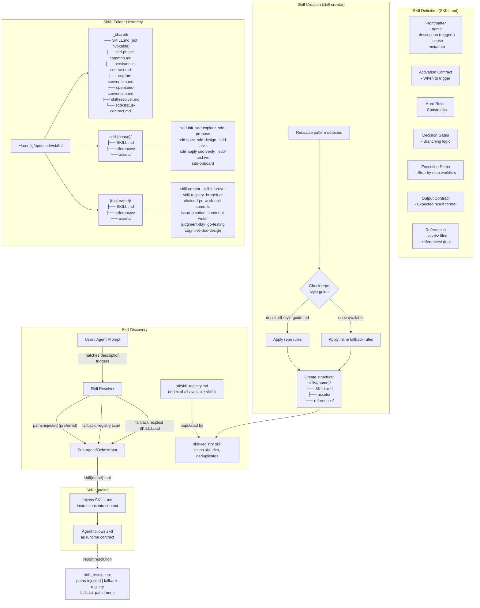
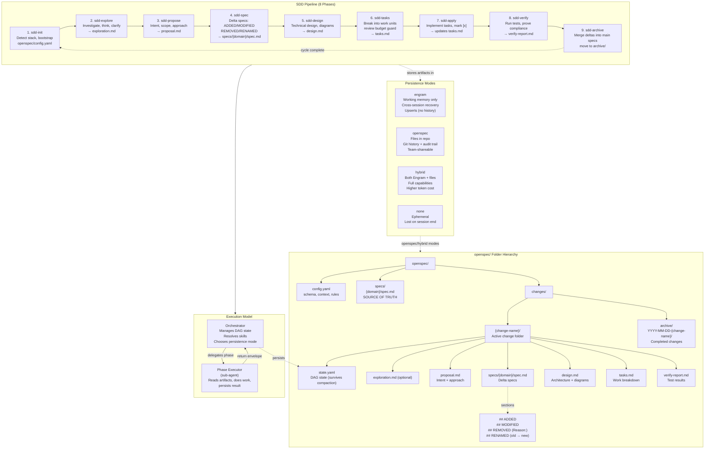
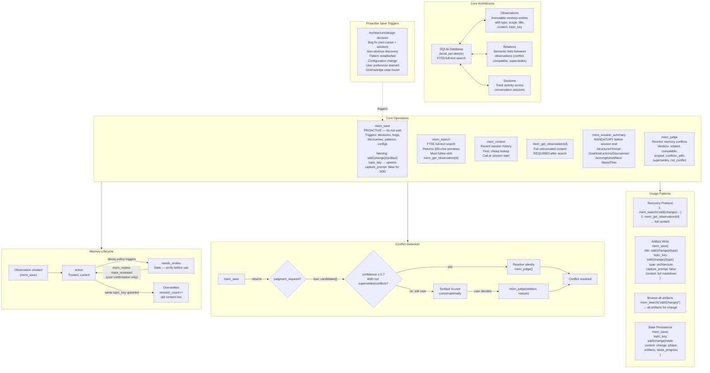

# System Architecture Diagrams

---

## 1. Skills System — How It Works



### Key concepts

| Concept | Description |
|---------|-------------|
| **SKILL.md** | Runtime instruction contract for an LLM — not human documentation |
| **description** | One-line YAML field with trigger words; the matching mechanism |
| **skill()** tool | Injects the skill's full instructions into the conversation context |
| **Skill Resolver** | Protocol for delegators to pass exact SKILL.md paths to sub-agents |
| **Skill Registry** | Index (`.atl/skill-registry.md` + Engram) of all available skills by trigger |
| **`_shared/`** | Support package with shared conventions — not invokable as a skill |
| **skill-creator** | Meta-skill that governs how new skills are authored and structured |

---

## 2. OpenSpec — Spec-Driven Development Pipeline



### Delta Spec Operations

| Operation | Section | Behavior |
|-----------|---------|----------|
| **ADDED** | New requirement | Appends to main spec |
| **MODIFIED** | Full updated requirement | Replaces matching block in main spec |
| **REMOVED** | Requirement + Reason | Deletes from main spec |
| **RENAMED** | Old → New name | Changes heading, preserves behavior |

### Review Budget Guard

Each change has a default 400-line PR review budget. `sdd-tasks` forecasts risk (Low/Medium/High) and may recommend chained PRs. `sdd-apply` must not start oversized work without explicit resolution.

---

## 3. Engram — Persistent Memory System



### Artifact Naming Convention

```
title:     sdd/{change-name}/{artifact-type}
topic_key: sdd/{change-name}/{artifact-type}
type:      architecture
```

| Artifact Type | Produced By | Purpose |
|---------------|-------------|---------|
| `explore` | sdd-explore | Exploration analysis |
| `proposal` | sdd-propose | Change proposal |
| `spec` | sdd-spec | Delta specifications |
| `design` | sdd-design | Technical design |
| `tasks` | sdd-tasks | Task breakdown |
| `apply-progress` | sdd-apply | Implementation progress |
| `verify-report` | sdd-verify | Verification report |
| `archive-report` | sdd-archive | Archive closure with lineage |
| `state` | orchestrator | DAG state for compaction recovery |

### Key Principles

- **Proactive saves**: save immediately after any significant event — do NOT wait to be asked
- **Upsert over insert**: same `topic_key` + `project` + `scope` updates the existing observation
- **No revision history**: Engram is working memory, not an audit trail — old content is overwritten
- **Two-step retrieval**: `mem_search` → truncated preview → `mem_get_observation(id)` → full content
- **Mandatory session summary**: every session must end with `mem_session_summary`
- **Deterministic naming**: the `sdd/{change}/{artifact}` convention enables exact-match recovery
- **capture_prompt: false**: mandatory for automated SDD pipeline artifacts
